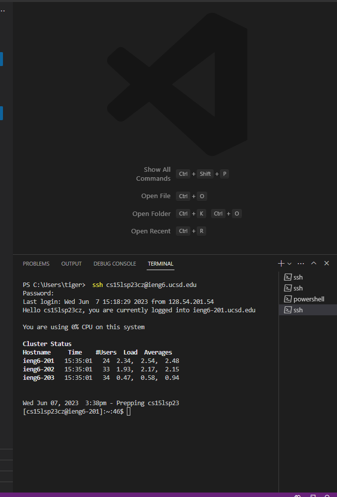
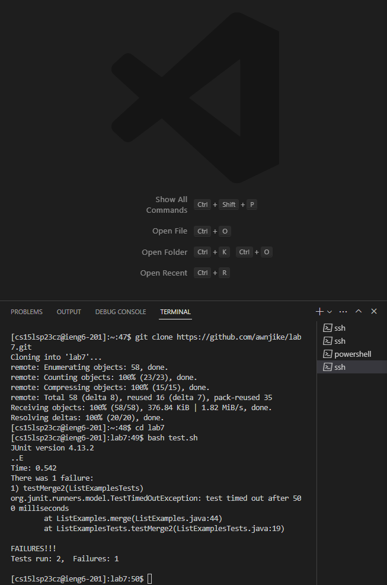
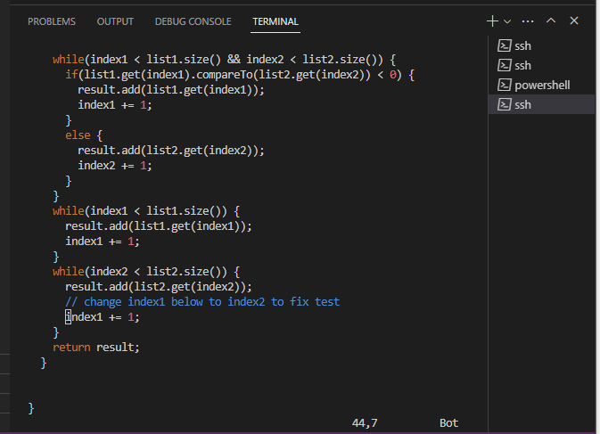
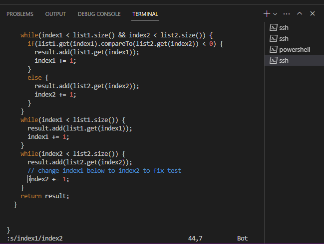
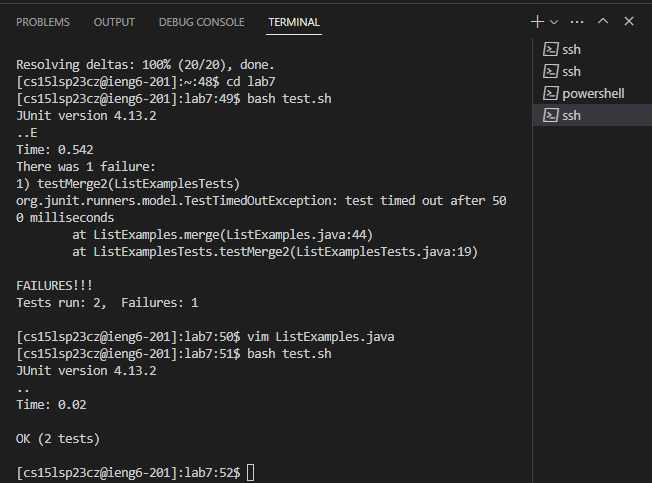
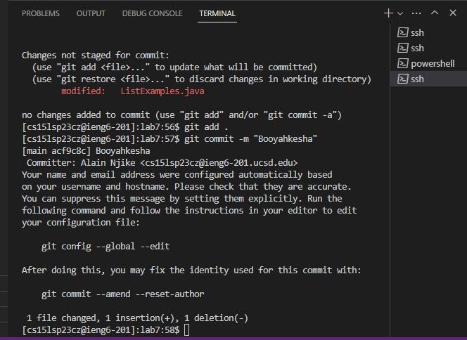
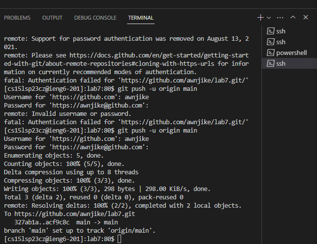

**Report 4**

**Steps:**

1. 

  Here I logged into my account
  `keys pressed: ssh cs15lsp23cz@ieng6.ucsd.edu`
2. 

 I then imported my for using the  command and made it my directory ran the test and saw that it failed
 ```
 keys pressed: 
 git clone https://github.com/ucsd-cse15l-s23/lab7<ENTER>
 cd lab7<ENTER>
 bash test.sh
 ```
3.
 
I then opend the ListExamples.java file in vim
```
keys pressed:  
vim ListExamples.java<ENTER>
```
4.
 
I then opend it up found the issue and changed the error, saved and then exited
   ```
   keys pressed:
   /index1
   N
   :s/index1/index2<ENTER>
   :wq<ENTER>
   ```
  
5.
 
I then re-ran the test and it passed
```
keys pressed:
bash test.sh<ENTER>
```

6.
 
I then commited
```
keys pressed:
commit -m "Booyahkesha"<ENTER>
```

7.
 

finally I pushed my work
```
keys pressed:
git push -u origin main<ENTER>
```
